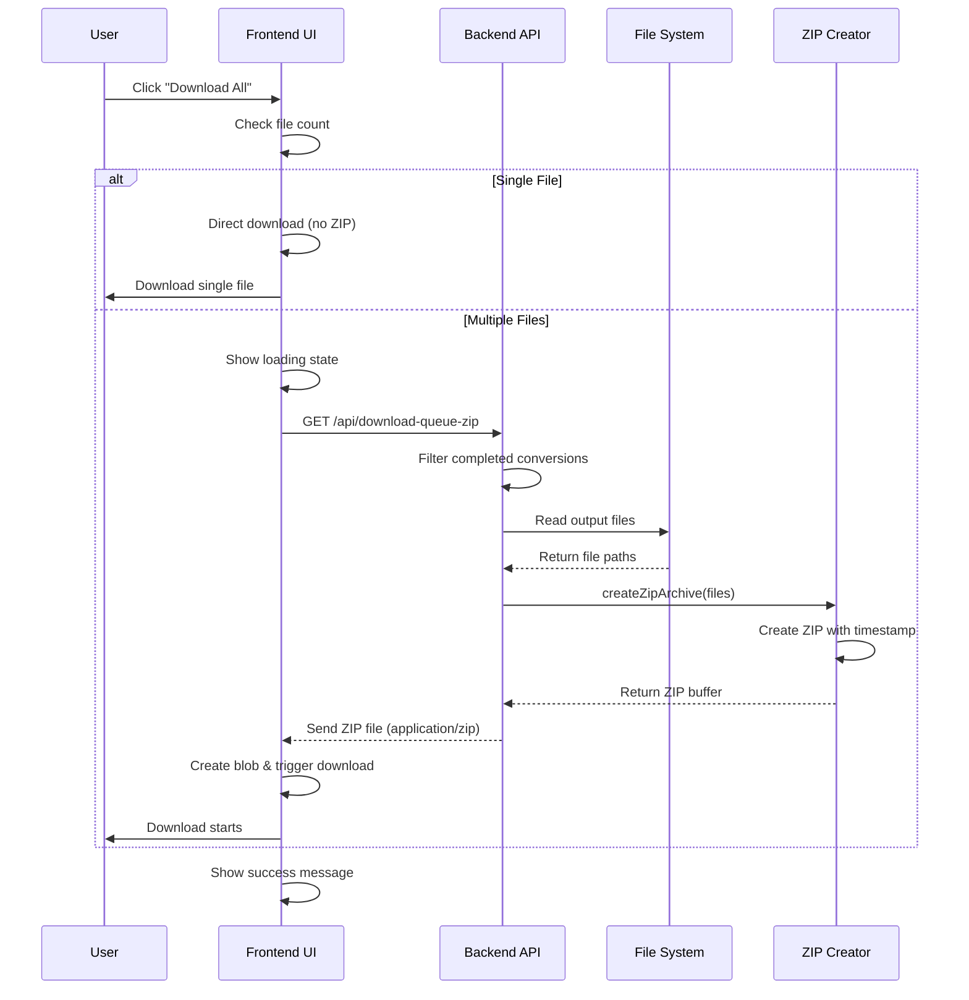
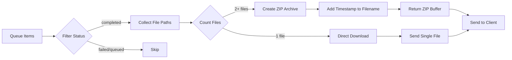

# Download All Feature - Architecture Diagram

## System Flow Diagram

```mermaid
graph TB
    subgraph "Frontend - User Interface"
        A[User clicks Download All ZIP]
        B[Processing Queue Section]
        C[Completed Files Section]
        D[JavaScript Handler]
        E[Show Loading State]
        F[Create Blob & Download]
    end
    
    subgraph "Backend - API Layer"
        G[/api/download-queue-zip]
        H[/api/download-history-zip]
        I[Filter Completed Files]
        J[Read Output Directory]
        K[createZipArchive Function]
    end
    
    subgraph "File System"
        L[Output Directory]
        M[Converted Files]
        N[ZIP Archive]
    end
    
    A --> B
    A --> C
    B --> D
    C --> D
    D --> E
    D --> G
    D --> H
    G --> I
    H --> J
    I --> K
    J --> K
    K --> L
    L --> M
    M --> N
    N --> F
    F --> A
```

## Component Interaction Flow



## Data Flow for Smart Download



## File Structure Changes

### Before
```
markdone-universal/
├── static/
│   ├── index.html (Secure Artifacts Vault)
│   └── app.js (No ZIP download)
└── server.ts (No ZIP endpoints)
```

### After
```
markdone-universal/
├── static/
│   ├── index.html (Completed Files + ZIP buttons)
│   └── app.js (ZIP download functions)
└── server.ts (ZIP endpoints + createZipArchive)
```

## UI Component Layout

```
┌─────────────────────────────────────────────────────────┐
│  Processing Queue                                        │
├─────────────────────────────────────────────────────────┤
│  ┌─────────┬──────┬────────┬────────┬────────┬────────┐ │
│  │ Name    │ Size │ Target │ Source │ Status │ Output │ │
│  ├─────────┼──────┼────────┼────────┼────────┼────────┤ │
│  │ file1...│ 2MB  │ MD     │ auto   │ ✓ Done │ ⬇ DL   │ │
│  │ file2...│ 1MB  │ HTML   │ auto   │ ✓ Done │ ⬇ DL   │ │
│  └─────────┴──────┴────────┴────────┴────────┴────────┘ │
│                                                           │
│  [Process Queue]  [Purge Staging]  [📦 Download All (2)]│
│                                                           │
│  Button text adapts:                                     │
│  • 0 files: "Download All" (disabled)                    │
│  • 1 file:  "⬇ Download File"                           │
│  • 2+ files: "📦 Download All as ZIP (5)"               │
└─────────────────────────────────────────────────────────┘

┌─────────────────────────────────────────────────────────┐
│  📁 Completed Files                                      │
├─────────────────────────────────────────────────────────┤
│  Successfully converted files ready for download.        │
│                                                           │
│  ┌─────────────┬──────┬─────────────────┬──────────────┐│
│  │ Name        │ Size │ Timestamp       │ Actions      ││
│  ├─────────────┼──────┼─────────────────┼──────────────┤│
│  │ output1.md  │ 2MB  │ 2026-04-26 11:00│ ⬇ Download  ││
│  │ output2.html│ 1MB  │ 2026-04-26 11:01│ ⬇ Download  ││
│  └─────────────┴──────┴─────────────────┴──────────────┘│
│                                                           │
│  [📦 Download All ZIP]  [🗑 Delete All Files]           │
└─────────────────────────────────────────────────────────┘
```

## CSS Fix for Long Filenames

### Problem
```
┌──────────────────────────────────────────┐
│ very-long-filename-that-breaks-the-table-│
│layout-and-causes-horizontal-scrolling.pdf│
└──────────────────────────────────────────┘
```

### Solution
```
┌──────────────────────────────────────────┐
│ very-long-filename-that-breaks-the-ta... │
│ (hover to see full name)                 │
└──────────────────────────────────────────┘
```

## API Endpoint Specifications

### GET /api/download-queue-zip

**Purpose:** Download all completed files from the current processing queue

**Request:**
```http
GET /api/download-queue-zip HTTP/1.1
Host: localhost:8000
```

**Response:**
```http
HTTP/1.1 200 OK
Content-Type: application/zip
Content-Disposition: attachment; filename="markdone-exports-2026-04-26-143022.zip"
Content-Length: 1048576

[ZIP binary data]
```

**Error Response:**
```http
HTTP/1.1 404 Not Found
Content-Type: application/json

{
  "message": "No completed files available for download"
}
```

### GET /api/download-history-zip

**Purpose:** Download all files from the completed files section

**Request:**
```http
GET /api/download-history-zip HTTP/1.1
Host: localhost:8000
```

**Response:**
```http
HTTP/1.1 200 OK
Content-Type: application/zip
Content-Disposition: attachment; filename="markdone-history-2026-04-26-143022.zip"
Content-Length: 2097152

[ZIP binary data]
```

**Error Response:**
```http
HTTP/1.1 404 Not Found
Content-Type: application/json

{
  "message": "No files available in history"
}
```

## State Management

### Button States

```javascript
// Disabled state (no files)
<button disabled>📦 Download All as ZIP (0)</button>

// Enabled state (files available)
<button>📦 Download All as ZIP (5)</button>

// Loading state (creating ZIP)
<button disabled>⏳ Creating ZIP...</button>
```

### User Feedback Messages

```javascript
feedback = "Creating ZIP archive...";        // During creation
feedback = "Downloaded 5 file(s) as ZIP.";   // Success
feedback = "No completed files to download."; // No files
feedback = "Failed to download ZIP archive."; // Error
```

## Performance Considerations

### Memory Usage
- **Small archives (<10MB):** Load entire ZIP in memory
- **Medium archives (10-100MB):** Stream if possible
- **Large archives (>100MB):** Consider chunking or warning

### Optimization Strategies
1. **Lazy Loading:** Only read files when creating ZIP
2. **Compression:** Use ZIP compression level 6 (balanced)
3. **Caching:** Don't cache ZIP files (create on-demand)
4. **Cleanup:** Remove temporary files after download

## Security Considerations

1. **Path Traversal:** Validate all file paths
2. **File Size Limits:** Enforce maximum ZIP size
3. **Rate Limiting:** Prevent abuse of ZIP endpoint
4. **Authentication:** Ensure user has access to files

## Browser Compatibility

| Browser | Version | Support |
|---------|---------|---------|
| Chrome  | 90+     | ✅ Full |
| Firefox | 88+     | ✅ Full |
| Safari  | 14+     | ✅ Full |
| Edge    | 90+     | ✅ Full |

## Testing Scenarios

### Functional Tests
- ✅ Download single file as ZIP
- ✅ Download multiple files as ZIP
- ✅ Download with long filenames
- ✅ Download with special characters in names
- ✅ Handle empty queue/history
- ✅ Handle failed conversions (exclude from ZIP)

### Edge Cases
- ✅ Very large files (>100MB)
- ✅ Many files (>50)
- ✅ Duplicate filenames
- ✅ Missing files (deleted after conversion)
- ✅ Concurrent downloads

### UI Tests
- ✅ Button enable/disable states
- ✅ Loading indicators
- ✅ Success/error messages
- ✅ Filename overflow display
- ✅ Mobile responsiveness

---

**Last Updated:** 2026-04-26  
**Version:** 1.0  
**Status:** Planning Complete