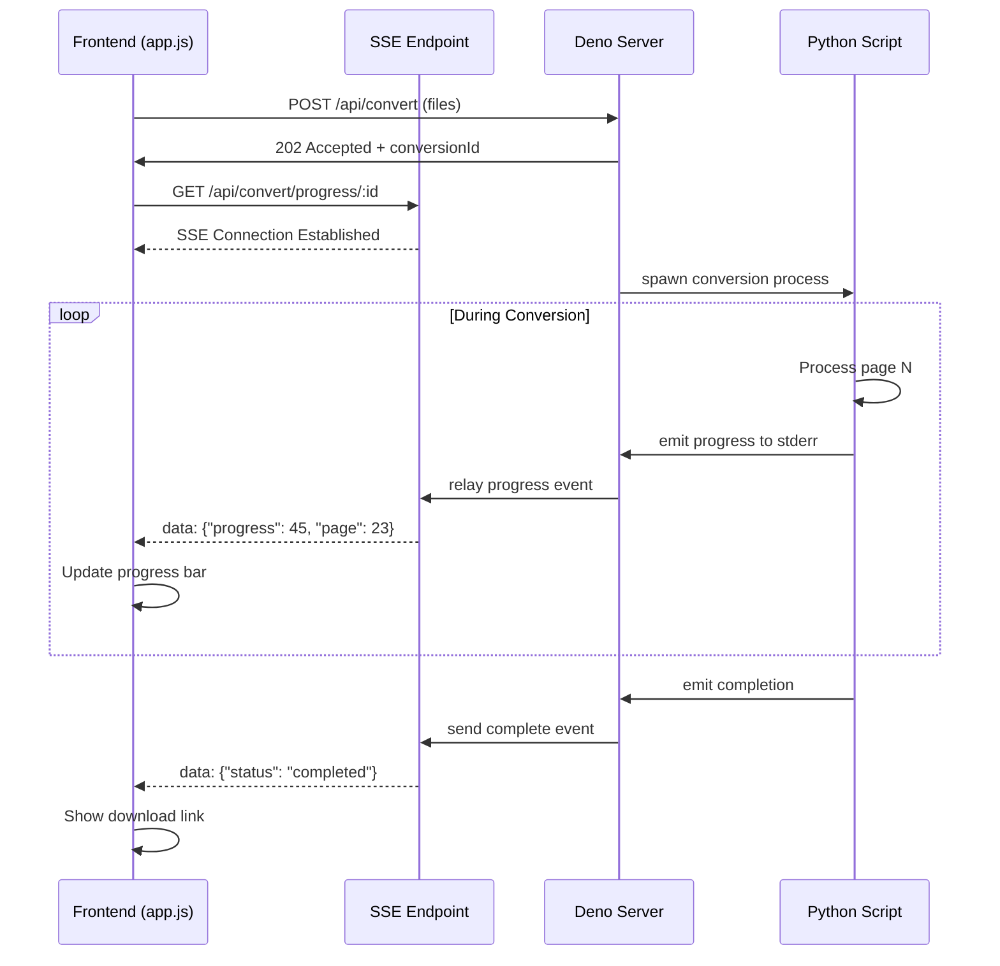

# Implementation Plan: SSE Progress & Tightened Permissions

## Overview
This document outlines the implementation plan to address two critical issues:
1. **No SSE progress for large files**: Add real-time progress feedback for file conversions
2. **Overly permissive Deno permissions**: Replace `--allow-all` with minimal required permissions

## Current State Analysis

### Issue 1: Silent Large File Conversions
- **Problem**: 50-page PDF conversions happen without user feedback
- **Impact**: Users don't know if the app is working or frozen
- **Current Flow**: 
  - Frontend uploads file → shows "converting" status
  - Backend processes silently → returns final result
  - No intermediate progress updates

### Issue 2: Security Risk with --allow-all
- **Problem**: `deno.json` uses `--allow-all` flag
- **Impact**: Grants unnecessary permissions (potential security vulnerability)
- **Current Permissions**: Unrestricted access to everything
- **Required Permissions**: 
  - `--allow-net`: HTTP server on configured port
  - `--allow-read`: Read uploads, services, static files
  - `--allow-write`: Write to uploads and outputs directories
  - `--allow-env`: Read environment variables for configuration
  - `--allow-run`: Execute Python3 and Pandoc subprocesses

## Technical Architecture

### SSE Progress Streaming



### Progress Event Format

**Python → Deno (via stderr):**
```json
{"type": "progress", "progress": 45, "current": 23, "total": 50, "message": "Processing page 23/50"}
```

**Deno → Frontend (via SSE):**
```
event: progress
data: {"conversionId": "abc-123", "progress": 45, "current": 23, "total": 50, "message": "Processing page 23/50"}

event: complete
data: {"conversionId": "abc-123", "status": "completed", "downloadUrl": "/api/downloads/file.md"}

event: error
data: {"conversionId": "abc-123", "error": "Conversion failed", "code": "EXTRACTION_FAILED"}
```

## Implementation Steps

### Phase 1: Python Progress Reporting

**File: `markdone-universal/services/high_fidelity_pdf.py`**

1. Add progress emission function:
```python
def emit_progress(current: int, total: int, message: str = "") -> None:
    """Emit progress to stderr for Deno to capture"""
    progress_data = {
        "type": "progress",
        "progress": int((current / total) * 100) if total > 0 else 0,
        "current": current,
        "total": total,
        "message": message
    }
    print(json.dumps(progress_data), file=sys.stderr, flush=True)
```

2. Modify `PDFExtractor.extract()` to emit progress after each page
3. Update `build_markdown()` to track and report progress

**File: `markdone-universal/services/xlsx_converter.py`**

1. Add similar progress emission for sheet/row processing
2. Report progress after each sheet is processed

### Phase 2: Deno SSE Endpoint

**File: `markdone-universal/server.ts`**

1. Add SSE connection manager:
```typescript
interface SSEConnection {
  conversionId: string;
  controller: ReadableStreamDefaultController;
  lastActivity: number;
}

const sseConnections = new Map<string, SSEConnection>();
```

2. Create SSE endpoint:
```typescript
router.get("/api/convert/progress/:conversionId", (ctx: Context) => {
  const conversionId = ctx.params.conversionId;
  
  const stream = new ReadableStream({
    start(controller) {
      sseConnections.set(conversionId, {
        conversionId,
        controller,
        lastActivity: Date.now()
      });
      
      // Send initial connection event
      const encoder = new TextEncoder();
      controller.enqueue(encoder.encode("event: connected\ndata: {}\n\n"));
    },
    cancel() {
      sseConnections.delete(conversionId);
    }
  });
  
  ctx.response.headers.set("Content-Type", "text/event-stream");
  ctx.response.headers.set("Cache-Control", "no-cache");
  ctx.response.headers.set("Connection", "keep-alive");
  ctx.response.body = stream;
});
```

3. Modify `runPythonConversion()` to capture stderr and relay progress:
```typescript
async function runPythonConversion(
  inputPath: string,
  outputPath: string,
  sourceType: SourceType,
  yamlFrontmatter: boolean,
  conversionId?: string
): Promise<{ sourceType: EffectiveSourceType; durationMs: number }> {
  // ... existing code ...
  
  const proc = new Deno.Command("python3", {
    args: [...],
    stdout: "piped",
    stderr: "piped",  // Capture stderr for progress
    cwd: Deno.cwd(),
  }).spawn();
  
  // Stream stderr for progress updates
  const stderrReader = proc.stderr.getReader();
  const decoder = new TextDecoder();
  
  (async () => {
    let buffer = "";
    while (true) {
      const { done, value } = await stderrReader.read();
      if (done) break;
      
      buffer += decoder.decode(value, { stream: true });
      const lines = buffer.split("\n");
      buffer = lines.pop() || "";
      
      for (const line of lines) {
        if (line.trim()) {
          try {
            const progressData = JSON.parse(line);
            if (progressData.type === "progress" && conversionId) {
              relayProgressToSSE(conversionId, progressData);
            }
          } catch {
            // Not JSON, ignore or log
          }
        }
      }
    }
  })();
  
  // ... rest of existing code ...
}

function relayProgressToSSE(conversionId: string, data: any) {
  const connection = sseConnections.get(conversionId);
  if (connection) {
    const encoder = new TextEncoder();
    const message = `event: progress\ndata: ${JSON.stringify(data)}\n\n`;
    connection.controller.enqueue(encoder.encode(message));
    connection.lastActivity = Date.now();
  }
}
```

4. Update `/api/convert` endpoint to generate and return conversionId

### Phase 3: Frontend Progress UI

**File: `markdone-universal/static/app.js`**

1. Add progress bar HTML (in `renderQueueTable()`):
```javascript
if (item.status === "converting" && item.progress !== undefined) {
  const progressDiv = document.createElement("div");
  progressDiv.className = "progress-container";
  progressDiv.innerHTML = `
    <div class="progress-bar">
      <div class="progress-fill" style="width: ${item.progress}%"></div>
    </div>
    <div class="progress-text">${item.progress}% (${item.current}/${item.total})</div>
  `;
  statusTd.appendChild(progressDiv);
}
```

2. Add SSE connection logic:
```javascript
function connectToProgress(conversionId, itemId) {
  const eventSource = new EventSource(`/api/convert/progress/${conversionId}`);
  
  eventSource.addEventListener("progress", (event) => {
    const data = JSON.parse(event.data);
    const item = queue.find(i => i.id === itemId);
    if (item) {
      item.progress = data.progress;
      item.current = data.current;
      item.total = data.total;
      updateDOM();
    }
  });
  
  eventSource.addEventListener("complete", (event) => {
    const data = JSON.parse(event.data);
    const item = queue.find(i => i.id === itemId);
    if (item) {
      item.status = "completed";
      item.downloadUrl = data.downloadUrl;
      item.outputName = data.outputFileName;
    }
    eventSource.close();
    updateDOM();
  });
  
  eventSource.addEventListener("error", () => {
    eventSource.close();
  });
  
  return eventSource;
}
```

3. Update `convertAll()` to use SSE for progress tracking

**File: `markdone-universal/static/index.html`**

Add CSS for progress bar:
```css
.progress-container {
  margin-top: 8px;
}

.progress-bar {
  width: 100%;
  height: 20px;
  background-color: #e0e0e0;
  border-radius: 10px;
  overflow: hidden;
}

.progress-fill {
  height: 100%;
  background: linear-gradient(90deg, #4CAF50, #45a049);
  transition: width 0.3s ease;
}

.progress-text {
  font-size: 11px;
  color: #666;
  margin-top: 4px;
  text-align: center;
}
```

### Phase 4: Tighten Deno Permissions

**File: `markdone-universal/deno.json`**

Replace:
```json
{
  "tasks": {
    "dev": "deno run --watch --allow-all server.ts",
    "start": "deno run --allow-all server.ts",
    "test:integration": "deno run --allow-net --allow-read --allow-env tests/integration.ts"
  }
}
```

With:
```json
{
  "tasks": {
    "dev": "deno run --watch --allow-net --allow-read --allow-write --allow-env --allow-run=python3,pandoc server.ts",
    "start": "deno run --allow-net --allow-read --allow-write --allow-env --allow-run=python3,pandoc server.ts",
    "test:integration": "deno run --allow-net --allow-read --allow-env tests/integration.ts"
  }
}
```

**Permissions Breakdown:**
- `--allow-net`: HTTP server (required for Oak framework)
- `--allow-read`: Read static files, uploads, services directory
- `--allow-write`: Write to uploads and outputs directories
- `--allow-env`: Read PORT, UPLOAD_DIR, OUTPUT_DIR, etc.
- `--allow-run=python3,pandoc`: Execute only these specific commands

## Testing Strategy

### Test 1: SSE Progress with Large PDF
1. Upload a 50-page PDF
2. Verify progress bar appears and updates smoothly
3. Confirm percentage increases from 0% to 100%
4. Check that page numbers (e.g., "23/50") display correctly
5. Verify download link appears after completion

### Test 2: Multiple Concurrent Conversions
1. Upload 3 large PDFs simultaneously
2. Verify each has independent progress tracking
3. Confirm semaphore limits concurrent conversions
4. Check that all complete successfully

### Test 3: Permission Restrictions
1. Start server with new restricted permissions
2. Test all endpoints: `/health`, `/api/convert`, `/api/downloads`, `/api/outputs`
3. Verify Python and Pandoc subprocesses execute successfully
4. Confirm file uploads and downloads work
5. Check that environment variables are read correctly

### Test 4: Error Handling
1. Test SSE connection loss (close browser tab mid-conversion)
2. Verify server cleans up orphaned SSE connections
3. Test Python script failure during conversion
4. Confirm error events propagate to frontend

## Security Improvements

### Before (Security Issues)
- ❌ `--allow-all`: Unrestricted file system access
- ❌ Can execute any command
- ❌ Can access any network resource
- ❌ No principle of least privilege

### After (Secure)
- ✅ `--allow-read`: Only reads necessary files
- ✅ `--allow-write`: Only writes to uploads/outputs
- ✅ `--allow-run=python3,pandoc`: Only specific commands
- ✅ `--allow-net`: Required for HTTP server
- ✅ `--allow-env`: Only reads environment variables
- ✅ Follows principle of least privilege

## Performance Considerations

1. **SSE Connection Overhead**: Minimal (~1KB per connection)
2. **Progress Event Frequency**: Emit per page (not per line) to avoid flooding
3. **Connection Cleanup**: Auto-close SSE after 5 minutes of inactivity
4. **Memory**: SSE connections stored in Map, cleaned up on completion

## Rollback Plan

If issues arise:
1. Revert `deno.json` to `--allow-all` temporarily
2. Disable SSE endpoint (comment out route)
3. Frontend gracefully degrades to polling or no progress
4. Python scripts work without progress emission (backward compatible)

## Documentation Updates

**README.md additions:**
1. Security section explaining permission model
2. Real-time progress feature description
3. Updated development instructions with new permissions

## Success Criteria

- ✅ Users see real-time progress for large file conversions
- ✅ Progress bar updates smoothly (no jumps or freezes)
- ✅ Deno runs with minimal required permissions
- ✅ All existing functionality continues to work
- ✅ No performance degradation
- ✅ Error handling works correctly
- ✅ Tests pass with new implementation

## Timeline Estimate

- Phase 1 (Python Progress): 2-3 hours
- Phase 2 (Deno SSE): 3-4 hours
- Phase 3 (Frontend UI): 2-3 hours
- Phase 4 (Permissions): 1 hour
- Testing & Documentation: 2-3 hours
- **Total: 10-14 hours**

## Next Steps

1. Review and approve this plan
2. Switch to Code mode for implementation
3. Implement phases sequentially
4. Test after each phase
5. Deploy and monitor

---

**Plan Status**: Ready for Review  
**Created**: 2026-04-25  
**Mode**: Plan Mode