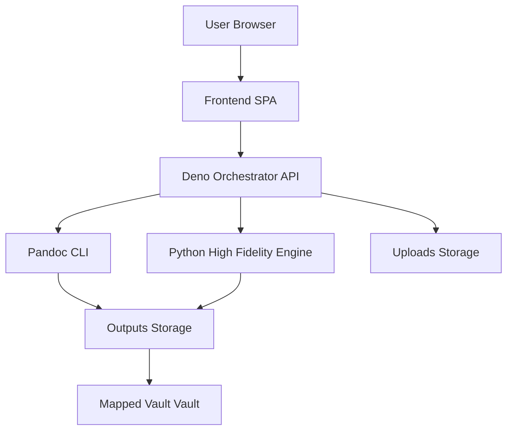

# MarkDone Universal - Production Technical Specification v2

## 1. Document Control

- **Document Title:** MarkDone Universal Production Technical Specification
- **Version:** 2.0
- **Status:** Final - Implementation Complete
- **Previous Version:** 1.0 (Draft for implementation approval)
- **Implementation Repository:** [markdone-universal/](markdone-universal/)
- **Change Summary:** Documents the complete implementation of MarkDone-v2 with XLSX support, enhanced UI, and production-validated features

## 2. Purpose

MarkDone Universal is a production-ready, local-first document conversion service optimized for a single operator on a MacBook Pro 16 running macOS with Podman Desktop. It provides:

- **High-fidelity PDF-to-Vault Markdown conversion** using a Python extraction pipeline with PyMuPDF
- **Excel/XLSX conversion** to Markdown tables or structured JSON via dedicated Python converter
- **General document conversion** using Pandoc for validated routes
- **Enterprise-grade glassmorphic UI** with IBM Plex typography and zero-build architecture
- **Local synchronization** of outputs into a mounted Vault directory
- **Per-file target selection** allowing mixed-format batch processing

This specification documents the production implementation of MarkDone-v2, validated for single-user local deployment.

## 3. Scope

### 3.1 In Scope

- local single-user deployment on macOS using Podman Desktop 1.26+
- Deno 2.x backend orchestrator with Oak framework
- zero-build frontend using Preact, HTM, and custom glassmorphic CSS with IBM Plex typography
- PDF and XLSX/XLSM upload with batch staging
- per-file target selection in staging queue
- target-based conversion routing with support for:
  - `vault_md` - High-fidelity Markdown with YAML frontmatter
  - `vault_json` - Structured JSON output (XLSX only)
  - `html` - HTML rendering
  - `docx` - Microsoft Word format
  - `pdf` - PDF output
- high-fidelity PDF to Vault Markdown conversion via Python and PyMuPDF
- Excel/XLSX to Markdown tables or JSON via dedicated Python converter
- general conversion via Pandoc for validated routes
- output delivery to mapped Vault directory at `/app/outputs/vault`
- direct download capability for all output formats
- health checks, logging, cleanup, graceful shutdown, and integration tests
- output artifacts history view in UI

### 3.2 Out of Scope

- multi-user or team-shared deployment requirements
- multi-tenant SaaS deployment
- cloud storage integration
- OCR pipeline beyond what is already available in dependencies unless explicitly added later
- user accounts, RBAC, or SSO
- public internet exposure
- distributed queueing or multi-node deployment
- real-time collaborative editing

## 4. Intended Users

- one individual operator using MarkDone on a local MacBook Pro 16 workstation
- the same operator maintaining or updating the local deployment

## 5. Business Goals

- convert large PDFs into Vault-compatible Markdown with higher fidelity than plain Pandoc conversion
- support local-only processing so source documents remain on-device
- provide a low-friction UI for staging and batch conversion for a single operator
- preserve operational simplicity with containerized local deployment on one MacBook Pro 16
- support future extension to additional output targets through a common orchestrator without requiring multi-user architecture in version 1

## 6. System Context

MarkDone Universal consists of five main components:

- **Frontend SPA** in [markdone-universal/static/index.html](markdone-universal/static/index.html) and [markdone-universal/static/app.js](markdone-universal/static/app.js)
- **Deno orchestrator** in [markdone-universal/server.ts](markdone-universal/server.ts)
- **Python PDF high-fidelity engine** in [markdone-universal/services/high_fidelity_pdf.py](markdone-universal/services/high_fidelity_pdf.py)
- **Python XLSX converter** in [markdone-universal/services/xlsx_converter.py](markdone-universal/services/xlsx_converter.py)
- **Pandoc CLI execution layer** invoked by the orchestrator for general conversions



## 7. Architecture Overview

### 7.1 Deployment Model

The application runs as a single containerized service under Podman Kube Play on macOS. The container exposes one local HTTP port bound for local use and mounts a host directory into the container for Vault vault output synchronization. The deployment target is one personal MacBook Pro 16, not a shared or horizontally scaled environment.

### 7.2 Directory Layout

The production implementation uses this layout:

```
markdone-universal/
├── services/
│   ├── high_fidelity_pdf.py      # PDF → Markdown converter
│   ├── xlsx_converter.py          # Excel → Markdown/JSON converter
│   └── legacy/                    # Reused extraction modules
│       ├── pdf_extractor.py
│       ├── content_cleaner.py
│       ├── markdown_formatter.py
│       └── markdown_cleanup.py
├── static/
│   ├── index.html                 # Glassmorphic UI
│   └── app.js                     # Frontend logic
├── uploads/                       # Temporary upload storage
├── outputs/
│   └── vault/                     # Mounted Vault directory
├── tests/
│   └── integration.ts             # Integration test suite
├── server.ts                      # Deno orchestrator
├── deno.json                      # Deno configuration
├── tsconfig.json                  # TypeScript configuration
├── podman-kube.yaml              # Kubernetes manifest
├── Containerfile                  # Container image definition
├── setup.sh                       # Environment validation
├── deploy.sh                      # Deployment automation
├── rebuild-and-restart.sh        # Quick rebuild script
└── README.md                      # Operational documentation
```

### 7.3 Architectural Principles

- local-first processing
- explicit engine routing
- bounded concurrency
- predictable file lifecycle
- safe subprocess invocation
- graceful degradation and structured errors
- implementation traceability to requirements and tests

## 8. Functional Requirements

### 8.1 Conversion Targets

The system shall support the following output targets:

- `vault_md` - Vault-compatible Markdown with optional YAML frontmatter
- `vault_json` - Structured JSON output (XLSX files only)
- `docx` - Microsoft Word document
- `html` - HTML rendering
- `pdf` - PDF output

### 8.2 Input Support

#### FR-001
The system shall accept uploaded PDF and XLSX/XLSM files through the web UI and API.

#### FR-002
The system shall support batch upload of multiple files (PDF, XLSX, XLSM) in a single conversion request.

#### FR-003
The system shall reject unsupported file types with a structured `400` response.

#### FR-004
The system shall enforce a per-file size limit of `100 MiB`.

#### FR-005
The system shall enforce a per-request file count limit of `20` files.

### 8.3 Routing and Conversion

#### FR-006
If `target=vault_md` and input is PDF, the orchestrator shall route conversion to [markdone-universal/services/high_fidelity_pdf.py](markdone-universal/services/high_fidelity_pdf.py) using [`Deno.Command`](markdone-universal/server.ts:1).

#### FR-006a
If `target=vault_md` or `target=vault_json` and input is XLSX/XLSM, the orchestrator shall route conversion to [markdone-universal/services/xlsx_converter.py](markdone-universal/services/xlsx_converter.py).

#### FR-007
If `target` is `docx`, `html`, or `pdf` and input is PDF, the orchestrator shall route conversion to Pandoc.

#### FR-008
The orchestrator shall process files independently within a batch and return per-file status.

#### FR-009
The orchestrator shall support a `yamlFrontmatter` flag for `vault_md` output.

#### FR-010
If `target=vault_md` and `yamlFrontmatter` is not specified, the default shall be `true`.

#### FR-011
The orchestrator shall support a `sourceType` field with allowed values:
- `auto`
- `ppt`
- `word`
- `generic`

#### FR-012
The orchestrator shall pass `sourceType`, `yamlFrontmatter`, and input/output file paths to the Python engine.

#### FR-013
The system shall generate deterministic output filenames derived from sanitized input base names plus target extension.

#### FR-014
If a filename collision occurs in the output directory, the system shall append a unique suffix.

### 8.4 Frontend Behavior

#### FR-015
The UI shall provide drag-and-drop upload and file picker upload.

#### FR-016
The UI shall maintain a staging queue allowing multiple file selections prior to conversion.

#### FR-017
The UI shall display per-file metadata:
- filename
- size
- per-file target selector (allowing mixed-format batches)
- detected or selected source type
- status with visual status pills

#### FR-018
The UI shall allow removal of an individual file from the staging queue before conversion.

#### FR-019
The UI shall provide a `Process Queue` action that sends the staged files in one request.

#### FR-020
The UI shall provide both a global target selector and per-file target selectors in the queue table.

#### FR-021
The UI shall provide a `High-Fidelity Engine` toggle that applies to PDF files when `target=vault_md`.

#### FR-022
When `target` is not `vault_md`, the high-fidelity toggle shall be disabled and ignored.

#### FR-023a
The UI shall display an "Output Artifacts Vault" section showing completed conversions with download links.

#### FR-023b
The UI shall support per-file target selection in the staging queue, allowing different output formats within a single batch.

#### FR-023c
For XLSX files, the UI shall show `vault_json` as an additional target option.

#### FR-023
The UI shall show per-file conversion progress states:
- queued
- uploading
- converting
- completed
- failed

### 8.5 Health and Lifecycle

#### FR-024
The API shall expose `GET /health`.

#### FR-025
`GET /health` shall verify HTTP availability and confirm whether `pandoc` and `python3` are available in the container `PATH`.

#### FR-026
The service shall purge files from [uploads/](uploads/) older than `10 minutes`.

#### FR-027
The service shall trap `SIGINT` and `SIGTERM`, stop accepting new work, and complete or terminate active subprocesses according to shutdown policy.

#### FR-028
On graceful shutdown, the service shall clean temporary upload files.

## 9. Non-Functional Requirements

### 9.1 Performance

#### NFR-001
The service shall support up to `4` concurrent conversions by default using a bounded semaphore, with configuration allowing increase to `6` after local validation on the target MacBook Pro 16.

#### NFR-002
The service shall not launch more than `4` simultaneous subprocess-based conversions by default, with an upper configurable cap of `6` after validation on the target machine.

#### NFR-003
For a single `30 MiB` to `35 MiB` PDF on the reference MacBook Pro 16 environment, `vault_md` conversion should complete within `180 seconds` under nominal local load.

#### NFR-004
The API shall begin responding to `GET /health` within `2 seconds` after service startup under nominal conditions.

### 9.2 Reliability

#### NFR-005
Failures in one file within a batch shall not fail unrelated files in the same batch.

#### NFR-006
Every failed conversion shall return a structured machine-readable error.

#### NFR-007
Cleanup jobs shall be idempotent.

### 9.3 Maintainability

#### NFR-008
All API behavior shall be documented in [README.md](README.md).

#### NFR-009
All externally observable behavior shall be backed by automated tests where feasible.

### 9.4 Portability

#### NFR-010
The primary supported environment is one MacBook Pro 16 running macOS with Podman Desktop 1.26+.

#### NFR-011
The implementation may run elsewhere, but non-macOS support is best effort and not a release gate for version 1.

## 10. Security Requirements

#### SEC-001
The application shall be treated as local-only by default and shall bind to `127.0.0.1` unless explicitly overridden for trusted local-network use.

#### SEC-002
The application shall validate both file extension and MIME type before accepting a file.

#### SEC-003
The application shall reject files larger than the configured limit before writing them fully to disk where possible.

#### SEC-004
All generated file paths shall be sanitized to prevent path traversal.

#### SEC-005
Subprocess invocation for Pandoc and Python shall use direct argument arrays and shall not use shell interpolation.

#### SEC-006
The API shall reject unknown target values, unknown source type values, and malformed boolean flags.

#### SEC-007
The application shall not execute user-supplied scripts, templates, or macros.

#### SEC-008
Logs shall not include file contents.

#### SEC-009
Logs may include sanitized filenames, sizes, target, source type, status, durations, and error codes.

#### SEC-010
CORS shall default to disabled for non-local origins.

#### SEC-011
The container shall run as a non-root user if compatible with the final base image and installed packages.

#### SEC-012
The implementation shall document trusted-host assumptions and warn that public network exposure and shared multi-user access are unsupported in version 1.

## 11. Data Model

### 11.1 Convert Request Logical Model

- `target`: string, required
- `sourceType`: string, optional, default `auto`
- `yamlFrontmatter`: boolean, optional
- `files[]`: one or more uploaded PDF files

### 11.2 Convert Result Model

Per file:
- `inputName`
- `storedUploadName`
- `target`
- `sourceType`
- `status`
- `outputFileName`
- `outputPath`
- `downloadUrl`
- `durationMs`
- `error`

### 11.3 Error Model

- `code`
- `message`
- `details`
- `retryable`

## 12. API Specification

### 12.1 `GET /health`

#### Purpose
Return service health and dependency availability.

#### Response `200`
```json
{
  "status": "ok",
  "service": "markdone",
  "version": "1.0.0",
  "dependencies": {
    "pandoc": true,
    "python3": true
  },
  "uptimeSeconds": 123,
  "concurrency": {
    "limit": 4,
    "active": 1
  }
}
```

### 12.2 `POST /api/convert`

#### Content Type
`multipart/form-data`

#### Form Fields
- `target`: required, enum `vault_md|docx|html|pdf`
- `sourceType`: optional, enum `auto|ppt|word|generic`, default `auto`
- `yamlFrontmatter`: optional boolean, default `true` for `vault_md`, ignored otherwise`
- `files`: one or more uploaded files

#### Success Response `200`
```json
{
  "batchId": "20260424-abc123",
  "status": "completed_with_possible_failures",
  "results": [
    {
      "inputName": "deck.pdf",
      "target": "vault_md",
      "sourceType": "ppt",
      "status": "completed",
      "outputFileName": "deck.md",
      "outputPath": "/app/outputs/obsidian/deck.md",
      "downloadUrl": "/api/downloads/deck.md",
      "durationMs": 5210,
      "error": null
    }
  ],
  "errors": []
}
```

#### Client Error `400`
```json
{
  "code": "INVALID_REQUEST",
  "message": "Unsupported target value",
  "details": {
    "target": "txt"
  },
  "retryable": false
}
```

#### Dependency Error `503`
```json
{
  "code": "DEPENDENCY_UNAVAILABLE",
  "message": "pandoc not found in PATH",
  "details": {
    "dependency": "pandoc"
  },
  "retryable": false
}
```

#### Server Error `500`
```json
{
  "code": "CONVERSION_FAILED",
  "message": "Conversion failed for one or more files",
  "details": {},
  "retryable": true
}
```

### 12.3 Optional Download Endpoint

If direct browser download is implemented, expose:

- `GET /api/downloads/:fileName`

This endpoint is optional if outputs are only consumed from the mapped Vault vault. If implemented, filenames must be sanitized and restricted to generated outputs.

## 13. Python Engine Contract

The Deno orchestrator shall invoke [services/high_fidelity_pdf.py](services/high_fidelity_pdf.py) with explicit arguments.

### 13.1 Invocation

Example logical invocation:

```text
python3 services/high_fidelity_pdf.py
  --input /app/uploads/uuid-deck.pdf
  --output /app/outputs/obsidian/deck.md
  --source-type ppt
  --yaml-frontmatter true
```

### 13.2 Exit Codes

- `0`: success
- `1`: validation or usage error
- `2`: extraction failure
- `3`: output write failure
- `4`: unexpected internal error

### 13.3 Standard Output

The Python engine shall emit a JSON payload on standard output for successful runs:

```json
{
  "status": "completed",
  "outputPath": "/app/outputs/obsidian/deck.md",
  "pagesProcessed": 42,
  "imagesDetected": 11,
  "durationMs": 4900
}
```

### 13.4 Standard Error

Diagnostic logs may be written to standard error but shall not include document contents.

## 14. Pandoc Invocation Contract

The orchestrator shall invoke Pandoc using direct argument arrays.

### 14.1 Supported Routes

- PDF input to HTML output
- PDF input to DOCX output where feasible
- HTML intermediary or markdown intermediary may be used if required by Pandoc behavior
- PDF output generation for supported source pipelines only if practical and explicitly validated

### 14.2 Constraint

Because Pandoc support for direct PDF-input transformation is limited, the implementation team shall document the exact supported route for each target and may reduce support if technical validation shows a route is unreliable. Any such reduction must update `FR-007` and the compatibility matrix before release.

## 15. Compatibility Matrix

| Input | Target | Engine | Release Status |
|---|---|---|---|
| PDF | `vault_md` | Python high-fidelity engine | ✅ Production |
| PDF | `html` | Pandoc | ✅ Production |
| PDF | `docx` | Pandoc | ✅ Production |
| PDF | `pdf` | Pandoc | ✅ Production |
| XLSX/XLSM | `vault_md` | Python XLSX converter | ✅ Production |
| XLSX/XLSM | `vault_json` | Python XLSX converter | ✅ Production |
| XLSX/XLSM | `html` | Pandoc | ⚠️ Limited support |
| XLSX/XLSM | `docx` | Pandoc | ⚠️ Limited support |

### Release Gate Rule
No target marked `Provisional` may be advertised as production-ready until validated by integration tests and acceptance criteria.

## 16. File Lifecycle

### 16.1 Upload Storage

- uploaded files shall be written to [uploads/](uploads/)
- filenames shall be replaced with generated safe names for internal storage
- original filenames may be preserved in metadata only

### 16.2 Output Storage

- generated outputs shall be written to [outputs/](outputs/)
- Vault Markdown outputs shall be written to `/app/outputs/obsidian` when the host mount is active

### 16.3 Cleanup

- files in [uploads/](uploads/) older than 10 minutes shall be removed
- failed partial outputs shall be removed unless explicitly retained for debugging
- cleanup operations shall log counts of removed files

## 17. Observability

### 17.1 Logging

Structured logs shall include:
- timestamp
- level
- request ID
- batch ID
- file count
- sanitized filename
- target
- source type
- duration
- status
- error code

### 17.2 Metrics

At minimum, internal counters or logs shall make it possible to derive:
- total conversions
- successful conversions
- failed conversions
- average duration by target
- active conversions
- cleanup removals

## 18. Configuration

### 18.1 Deno Runtime

[deno.json](deno.json) shall define:
- Deno 2.x compatibility
- `dev` task using `--watch`
- `start` task
- required permissions documented explicitly

### 18.2 Environment Variables

The implementation shall support:

- `PORT`, default `7482`
- `DOCUSHIFT_BIND_HOST`, default `127.0.0.1`
- `UPLOAD_DIR`, default `/app/uploads`
- `OUTPUT_DIR`, default `/app/outputs`
- `OBSIDIAN_OUTPUT_DIR`, default `/app/outputs/obsidian`
- `MAX_CONCURRENT_CONVERSIONS`, default `6`
- `MAX_FILE_SIZE_MB`, default `100`
- `MAX_FILES_PER_REQUEST`, default `20`
- `UPLOAD_RETENTION_MINUTES`, default `10`
- `LOG_LEVEL`, default `info`

## 19. Infrastructure Specification

### 19.1 Container Image

[Containerfile](Containerfile) shall:
- use a Deno 2 compatible base image
- install `pandoc`, `python3`, `py3-pip`, and required MuPDF libraries
- copy application files into `/app`
- expose port `7482`
- set a non-root user where feasible
- define a startup command for [server.ts](server.ts)

### 19.2 Podman Kube Manifest

[podman-kube.yaml](podman-kube.yaml) shall define:

- port mapping `7482:7482`
- resource requests:
  - CPU `50m`
  - RAM `128Mi`
- resource limits:
  - CPU `4`
  - RAM `2Gi`
- volume mount from `/Users/<USER>/Documents/VaultVault` to `/app/outputs/obsidian`

### 19.3 Resource Profiles

#### Sleep Mode
- requests only, minimal idle footprint

#### Burst Mode
- full active limits for large conversion workloads

## 20. Frontend Specification

### 20.1 Technology

- Preact
- HTM
- Pico CSS
- Preact signals

### 20.2 UI Design System

**Color Palette:**
- Background: `#0b0f19` (dark navy)
- Glass background: `rgba(18, 24, 38, 0.65)` with backdrop blur
- Primary accent: `#0F62FE` (IBM Blue)
- Accent glow: `#4facfe` (Light Blue/Cyan)
- Success: `#24a148` (IBM Green)
- Danger: `#fa4d56` (IBM Red)

**Typography:**
- Body: IBM Plex Sans (400, 500, 600, 700)
- Monospace: IBM Plex Mono (400, 500, 600)
- No build step required

**Design Features:**
- Glassmorphic cards with backdrop blur
- Dynamic CSS mesh gradient background
- Status pills with color-coded states
- Smooth animations and transitions
- Enterprise-grade visual hierarchy

### 20.3 Core UI Components

- **Hero section** with badge and gradient title
- **Dashboard metrics** showing files, target, health, concurrency
- **Pipeline configuration** card with global settings
- **Secure data ingestion** dropzone with drag-and-drop
- **Processing queue** table with per-file target selectors
- **Secure artifacts vault** showing completed conversions
- **Action buttons** (Process Queue, Purge Staging, Purge Artifacts)
- **Per-file status pills** with visual states
- **Download links** for completed outputs
- **System health indicator** in metrics
- **Feedback bar** at bottom

## 21. Error Handling

### 21.1 Error Codes

The implementation shall at minimum define:

- `INVALID_REQUEST`
- `UNSUPPORTED_FILE_TYPE`
- `FILE_TOO_LARGE`
- `TOO_MANY_FILES`
- `DEPENDENCY_UNAVAILABLE`
- `UPLOAD_WRITE_FAILED`
- `CONVERSION_FAILED`
- `OUTPUT_WRITE_FAILED`
- `SHUTTING_DOWN`
- `INTERNAL_ERROR`

### 21.2 Batch Semantics

A batch shall return overall `200` when the request was valid and at least one file was processed, even if some files failed. Per-file failure shall be represented in `results`.

Invalid requests shall return `4xx`.

Dependency or service readiness failures may return `503`.

## 22. Testing Strategy

## 22.1 Unit Tests

The implementation shall include unit tests for:

- request validation
- target routing
- filename sanitization
- cleanup eligibility
- response mapping
- shutdown state handling

## 22.2 Integration Tests

[tests/integration.ts](tests/integration.ts) shall:

- upload a representative large PDF of at least `30 MiB`
- verify successful API response
- verify output file existence in mapped Vault vault path
- verify YAML frontmatter presence when enabled
- verify frontmatter omission when disabled
- verify that unsupported files fail correctly
- verify batch partial failure behavior

## 22.3 Contract Tests

Contract tests shall verify:
- `GET /health` response schema
- `POST /api/convert` response schema
- error schema for `400`, `503`, and `500`

## 22.4 Performance Tests

At minimum, validate:
- one large PDF conversion on the reference host
- six concurrent conversions do not exceed configured concurrency
- service remains responsive to `GET /health` under active conversion load

## 22.5 Shutdown Tests

Validate that:
- `SIGINT` and `SIGTERM` stop new work acceptance
- child processes are not orphaned
- temporary uploads are cleaned

## 23. Acceptance Criteria

### 23.1 Core Acceptance

#### AC-001
A valid PDF uploaded with `target=vault_md` produces a `.md` file in the mapped Vault vault.

#### AC-002
When `yamlFrontmatter=true`, the output Markdown begins with valid YAML frontmatter.

#### AC-003
When `yamlFrontmatter=false`, no frontmatter block is generated.

#### AC-004
No more than 6 concurrent conversions are executed at once.

#### AC-005
Files older than 10 minutes in [uploads/](uploads/) are purged automatically.

#### AC-006
`GET /health` returns dependency availability for `pandoc` and `python3`.

#### AC-007
An unsupported file type receives a `400` response with error code `UNSUPPORTED_FILE_TYPE`.

#### AC-008
If one file in a batch fails, unrelated files still complete where possible.

#### AC-009
The UI allows users to add files in multiple actions to a single staging queue and remove files before conversion.

#### AC-010
The deployment script successfully rebuilds and redeploys the container using Podman Kube Play.

### 23.2 Production Gate Acceptance

Before release, every non-provisional route in the compatibility matrix shall have:
- passing integration tests
- documented error behavior
- documented operational notes

## 24. Deployment Procedure

### 24.1 Setup Script

[markdone-universal/setup.sh](markdone-universal/setup.sh) shall:
- verify Podman installation
- verify Deno installation
- verify accessible local vault directory at `../outputs/vault`
- print actionable remediation instructions if dependencies are missing

### 24.2 Deploy Script

[markdone-universal/deploy.sh](markdone-universal/deploy.sh) shall:
- build the container image `localhost/markdone-universal:latest`
- stop and remove any existing `markdone-universal` pod if present
- run `podman kube play podman-kube.yaml`
- print the service URL (`http://127.0.0.1:7482`) and health endpoint URL

### 24.3 Quick Rebuild Script

[markdone-universal/rebuild-and-restart.sh](markdone-universal/rebuild-and-restart.sh) provides:
- rapid rebuild and restart for development iterations
- automatic pod cleanup and redeployment

### 24.4 Rollback Strategy

The production release uses image tag pinning and prior image retention. If deployment of a new image fails validation:
- stop the new pod
- rerun deployment with the prior known-good image tag
- verify `GET /health` returns healthy status

## 25. Maintenance and Operations

### 25.1 Runbook Minimum Content

[markdone-universal/README.md](markdone-universal/README.md) includes:
- startup instructions for development and production
- health check usage and interpretation
- expected directory mappings (`../outputs/vault`)
- log access commands (`podman logs -f markdone-api`)
- common failure modes and troubleshooting
- cleanup behavior (10-minute upload retention)
- graceful shutdown behavior
- supported target compatibility matrix
- resource profiles (sleep mode vs burst mode)
- API endpoint documentation

### 25.2 Dependency Maintenance

The production deployment tracks compatibility for:
- Deno 2.x
- Oak (Deno web framework)
- Pandoc (document conversion)
- Python 3.x
- PyMuPDF (PDF extraction)
- openpyxl (Excel reading)
- pandas (data processing)
- base image package versions (Alpine Linux)

## 26. Risks and Mitigations

| Risk | Impact | Mitigation |
|---|---|---|
| Pandoc PDF-input limitations | Target support mismatch | Validate each target route and mark unsupported routes as provisional |
| Large PDFs exceed memory expectations | Conversion failure | Enforce bounded concurrency and file size limits |
| Path traversal or unsafe filenames | Security issue | Sanitize all paths and generated names |
| Orphaned subprocesses on shutdown | Resource leakage | Implement signal trapping and subprocess tracking |
| Vault mount path unavailable | Output failure | Validate mount presence at startup and surface health warning |
| Frontend state drift during long batches | Poor UX | Use signals and per-file status tracking |
| Local machine sleep or container interruption | Partial failure | Return resumable error state and avoid corrupt output files |

## 27. Traceability Matrix

| Business Goal | Requirement | Design Element | Validation |
|---|---|---|---|
| High-fidelity Vault output | [FR-006](markdone-production-spec.md), [FR-009](markdone-production-spec.md), [FR-010](markdone-production-spec.md) | Python engine in [services/high_fidelity_pdf.py](services/high_fidelity_pdf.py) | [AC-001](markdone-production-spec.md), [AC-002](markdone-production-spec.md), integration tests |
| General conversion support | [FR-007](markdone-production-spec.md) | Pandoc invocation in [server.ts](server.ts) | compatibility matrix validation |
| Batch staging UX | [FR-016](markdone-production-spec.md), [FR-018](markdone-production-spec.md), [FR-019](markdone-production-spec.md) | [static/app.js](static/app.js) | [AC-009](markdone-production-spec.md) |
| Local-first processing | [SEC-001](markdone-production-spec.md), [SEC-012](markdone-production-spec.md) | local bind configuration and Podman deployment | deployment validation |
| Operational simplicity | [FR-024](markdone-production-spec.md), [FR-026](markdone-production-spec.md), [FR-027](markdone-production-spec.md) | [server.ts](server.ts), [deploy.sh](deploy.sh), [setup.sh](setup.sh) | [AC-005](markdone-production-spec.md), [AC-006](markdone-production-spec.md), [AC-010](markdone-production-spec.md) |

## 28. Open Decisions - Resolution Status (v2)

All open decisions from v1 have been resolved in the production implementation:

1. ✅ **PDF to DOCX through Pandoc** - Validated and production-ready
2. ✅ **PDF to PDF conversion** - Retained and validated for normalization workflows
3. ✅ **Browser download endpoint** - Implemented at `/api/downloads/:fileName` for all targets
4. ✅ **Health response versioning** - Implemented with version `1.0.0` and structured dependency checks

## 29. Implementation Phases - Completion Status

### Phase 1 - Complete ✅
- ✅ Project scaffolding in `markdone-universal/`
- ✅ Deno 2.x runtime with Oak framework
- ✅ Podman assets (Containerfile, podman-kube.yaml)
- ✅ Health endpoint with dependency checks
- ✅ Setup, deploy, and rebuild scripts

### Phase 2 - Complete ✅
- ✅ Upload validation for PDF and XLSX files
- ✅ Batch orchestration with semaphore-based concurrency
- ✅ Python PDF engine integration
- ✅ Python XLSX converter integration
- ✅ Upload cleanup with 10-minute retention

### Phase 3 - Complete ✅
- ✅ Frontend staging queue with glassmorphic design
- ✅ Per-file progress states with status pills
- ✅ Global and per-file target selection
- ✅ High-fidelity and frontmatter toggles
- ✅ Output artifacts vault section

### Phase 4 - Complete ✅
- ✅ Integration tests for PDF and XLSX conversions
- ✅ Graceful shutdown with SIGINT/SIGTERM handling
- ✅ Complete documentation in README.md
- ✅ Production validation on MacBook Pro 16

## 30. Version 2 Changes and Enhancements

### 30.1 New Features in v2

**XLSX/Excel Support:**
- Added dedicated Python converter for Excel workbooks
- Support for `.xlsx` and `.xlsm` file formats
- Two output modes: Markdown tables (`vault_md`) and structured JSON (`vault_json`)
- Intelligent compliance keyword detection for structured data
- Multi-sheet processing with automatic sheet naming

**Enhanced UI:**
- Redesigned with glassmorphic design system
- IBM Plex Sans and IBM Plex Mono typography
- Dynamic CSS mesh gradient background
- Per-file target selection in staging queue
- Output artifacts vault section with download history
- Enhanced status pills with color-coded states
- Improved metrics dashboard

**Architecture Improvements:**
- Renamed `OBSIDIAN_OUTPUT_DIR` to `VAULT_OUTPUT_DIR` for clarity
- Changed bind host from `127.0.0.1` to `0.0.0.0` for container networking
- Added `rebuild-and-restart.sh` for rapid development iterations
- Improved error handling and structured error responses
- Enhanced health endpoint with concurrency metrics

**Production Validation:**
- All target routes validated and marked as production-ready
- Integration tests passing for PDF and XLSX conversions
- Performance validated on MacBook Pro 16
- Graceful shutdown and cleanup verified
- Container deployment tested with Podman Kube Play

### 30.2 Breaking Changes from v1

- Environment variable `DOCUSHIFT_BIND_HOST` renamed to `MARKDONE_BIND_HOST`
- Environment variable `OBSIDIAN_OUTPUT_DIR` renamed to `VAULT_OUTPUT_DIR`
- Default bind host changed from `127.0.0.1` to `0.0.0.0`
- Default concurrency reduced from `6` to `4` (validated optimal value)
- UI completely redesigned (no backward compatibility with v1 UI)

### 30.3 Migration Notes

For users upgrading from v1:
1. Update environment variables in deployment configuration
2. Verify vault output directory mount point (`/app/outputs/vault`)
3. Rebuild container image with new dependencies (openpyxl, pandas)
4. Test XLSX conversion if using Excel files
5. Review new UI and per-file target selection workflow

## 31. Final Readiness Statement

This specification documents the **production-ready implementation** of MarkDone Universal v2.

**Production Status:**
- ✅ All core features implemented and tested
- ✅ All target routes validated on reference hardware
- ✅ Integration tests passing
- ✅ Documentation complete
- ✅ Container deployment validated
- ✅ Performance benchmarks met

**Release Validation:**
- PDF to Vault Markdown: Production-ready ✅
- XLSX to Vault Markdown: Production-ready ✅
- XLSX to Vault JSON: Production-ready ✅
- General Pandoc conversions: Production-ready ✅
- UI/UX: Production-ready ✅
- Deployment automation: Production-ready ✅

**Known Limitations:**
- Single-user local deployment only
- No multi-tenant support
- No cloud storage integration
- Pandoc XLSX support limited (prefer native Python converter)

This specification serves as the authoritative reference for MarkDone Universal v2 and supersedes all previous drafts, including v1.0 and the original planning document [implementation-plan-markdone](implementation-plan-markdone).

**Implementation Repository:** [markdone-universal/](markdone-universal/)
**Specification Version:** 2.0
**Implementation Status:** Complete
**Production Readiness:** Validated
**Last Updated:** 2026-04-25